# JobStop

## Description
JobStop is an iOS application in Swift that allows users to view income and growth projection data** for a given job. Users can view this information for a single job, compare two jobs within the same state, and even compare two jobs across different states. Moreover, when viewing income data, users can also adjust the raw income for the cost of living in that state, which is particularly useful when comparing jobs across different states. 

Built With: Xcode, Swift, UIKit, SwiftUI

**Data Source: U.S. Bureau of Labor Statistics (BLS)

## UI Demonstration
### Initial Landing Page

--------------------------------
### Viewing Data for a Single Job
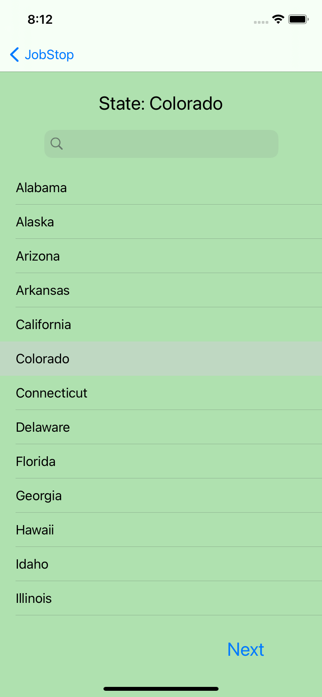
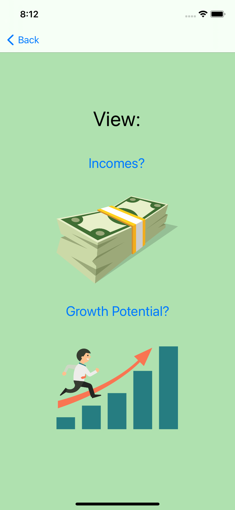
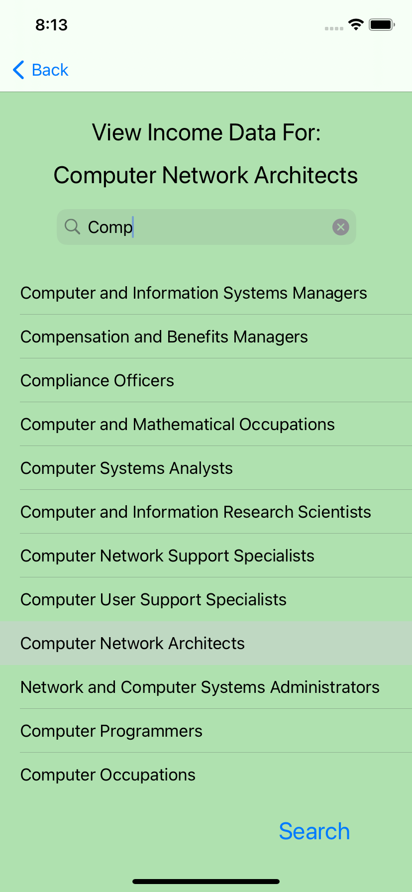
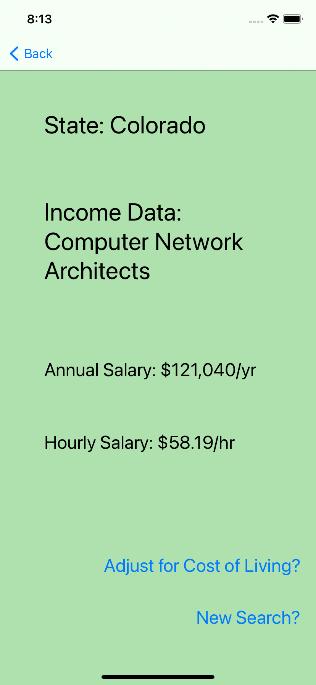
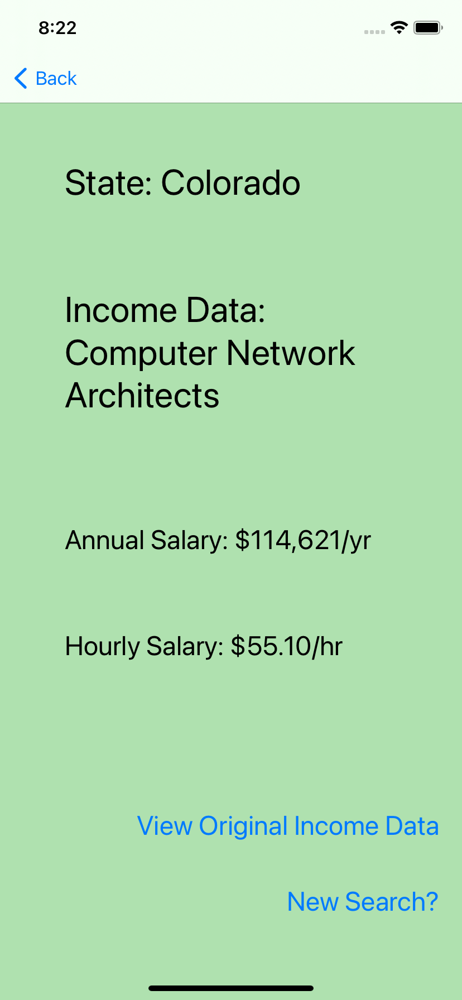

--------------------------------
### Comparing Two Jobs Within Same State
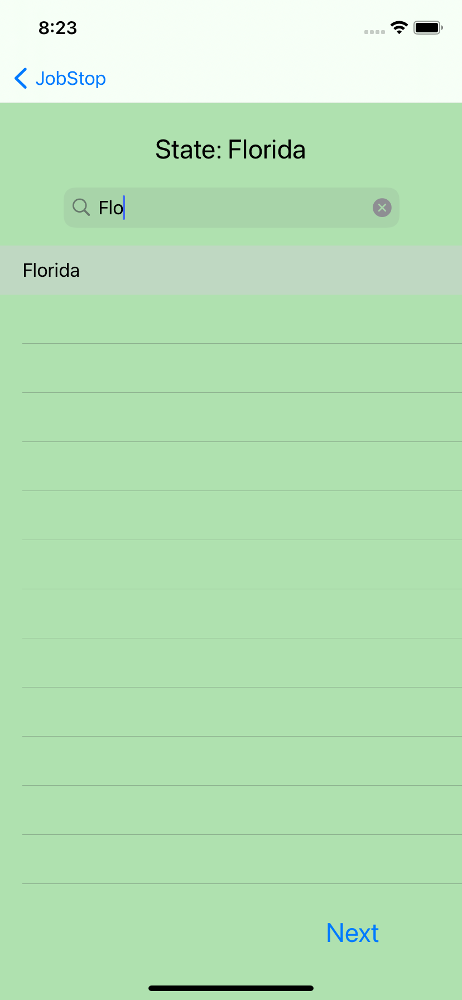
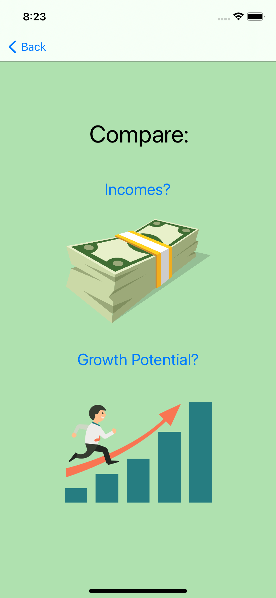
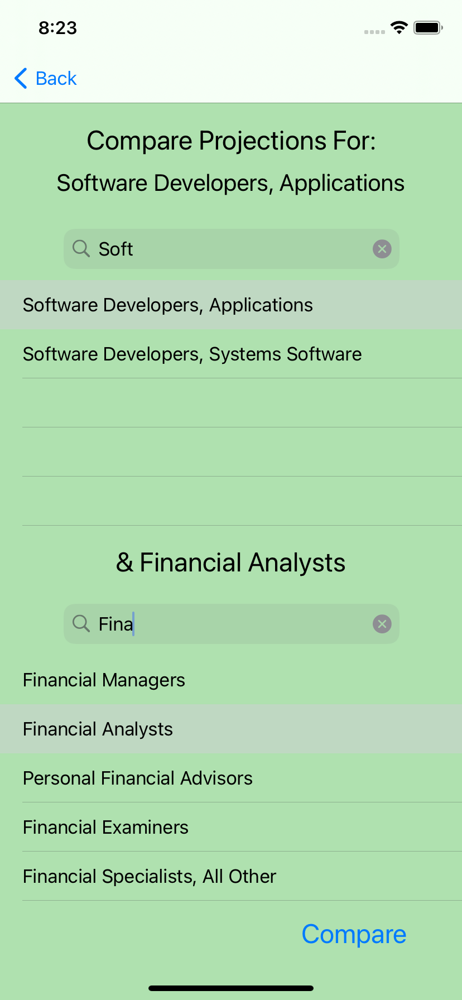
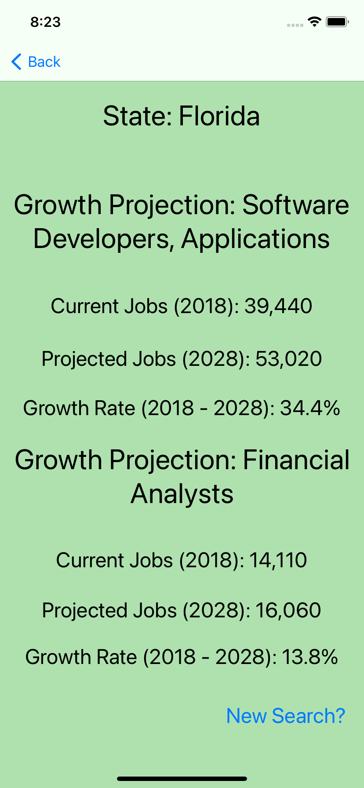

--------------------------------
### Comparing Two Jobs in Different States
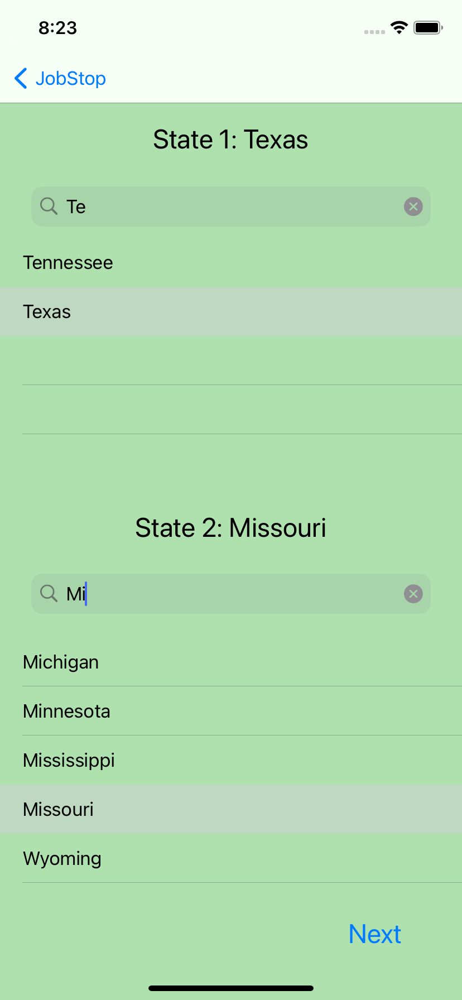
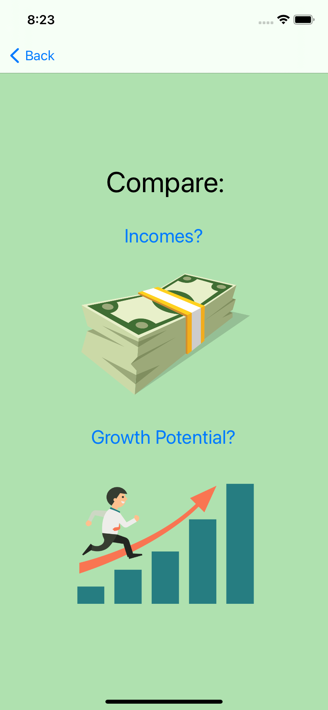
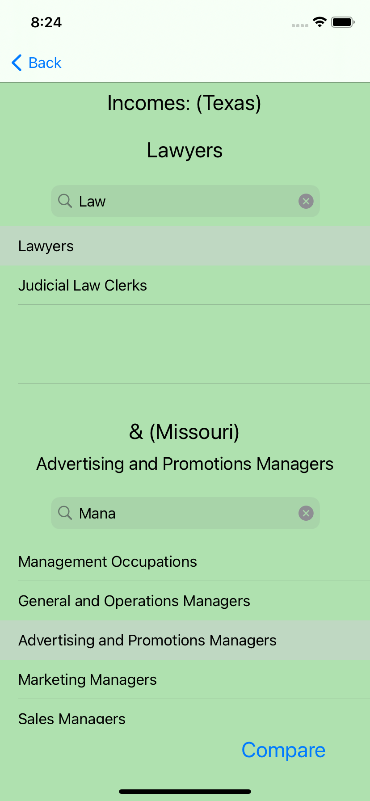S
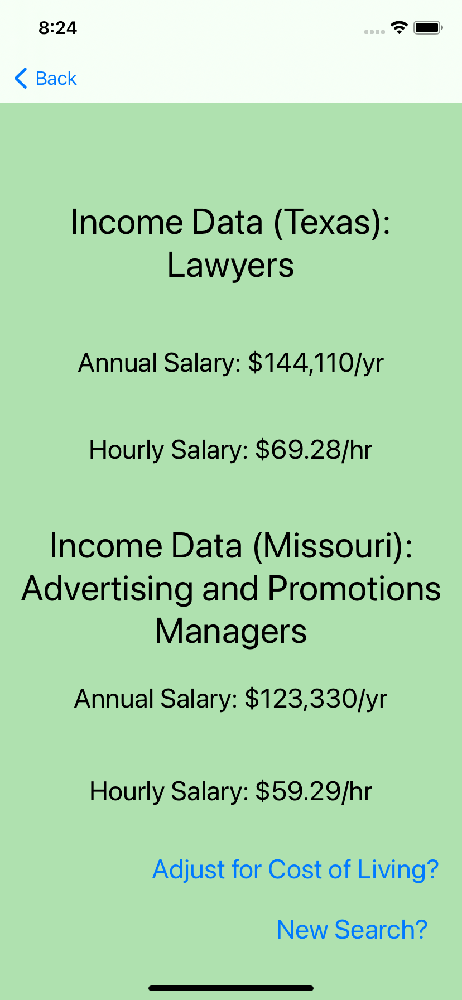
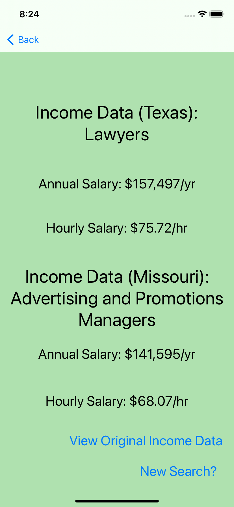
